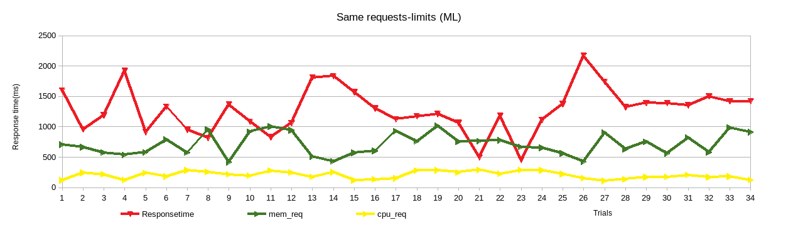
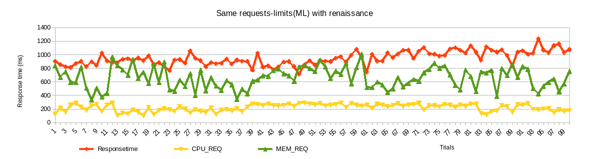

# Summary of data
- With renaissance, the ML algorithm behaves differently compared to no-load, because of different CPU and MEM usage by other applications.
- Doing ML experiments with load is not recommended for testing purposes.

## Tunables:
cpurequest
memrequest

