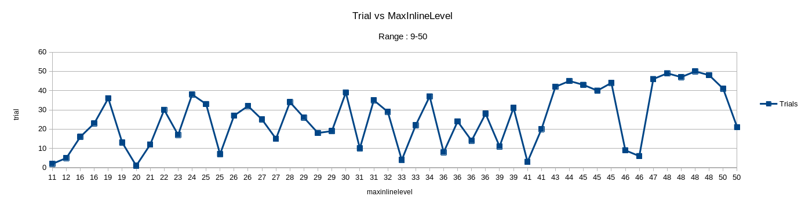
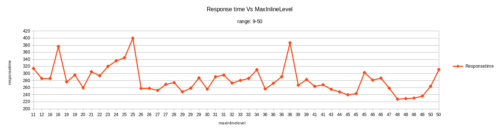

# Summary of data
- Min response time is observed with MaxInlineLevel=48
- 5.1% reduced response time is observed.

## Tunables:
MaxInlineLevel range used is 9-50

## Configuration Used:
CPU_REQUEST=2.87
MEM_REQUEST=669M
CPU_LIMIT=3.5
MEM_LIMIT=1024M

