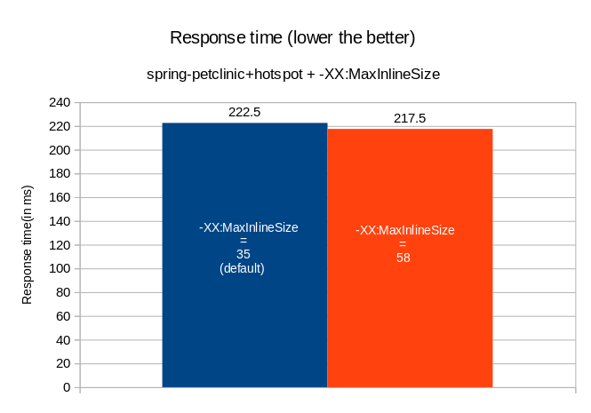

# Summary of all experiments
- Min response time is observed with MaxInlineSize=58
- 2.3% reduced response time is observed.

## Tunables:
MaxInlineSize range used is 10-100
- value represents the maximum bytecode size of a method to be inlined

## Configuration Used:
CPU_REQUEST=2.87
MEM_REQUEST=669M
CPU_LIMIT=3.5
MEM_LIMIT=1024M

Above graph comparison is based on [experiment-1](https://github.com/kruize/autotune-results/tree/main/spring-petclinic/tunables-maxinlinesize/experiment-1) data.
