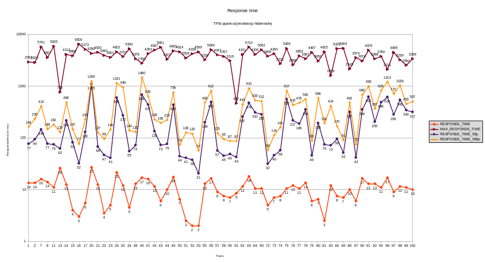
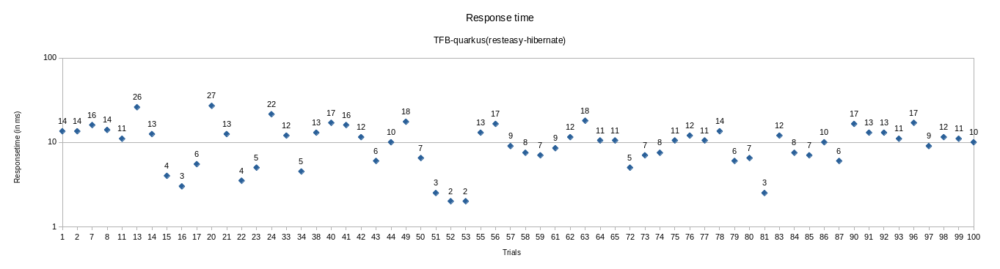
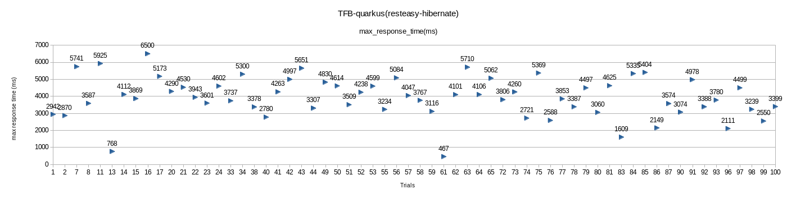
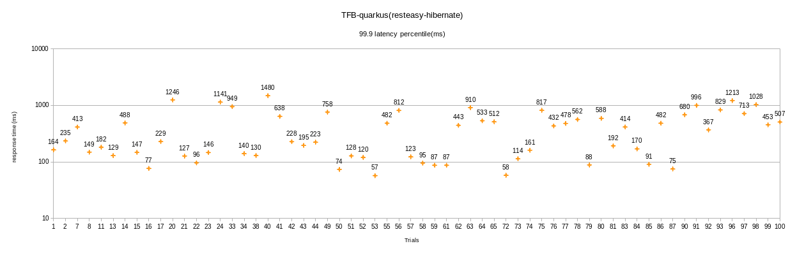
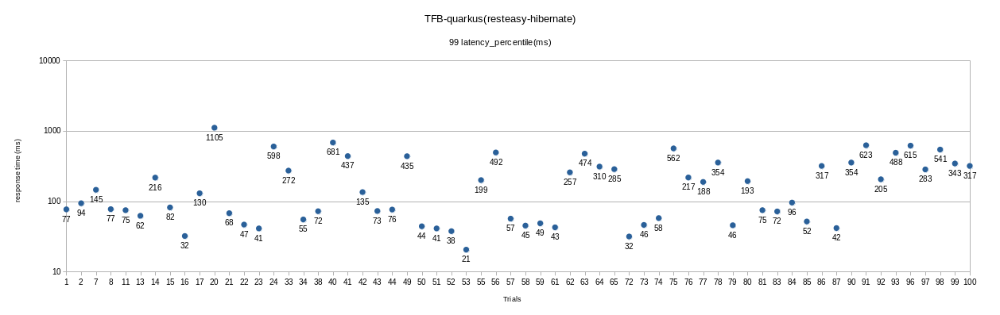
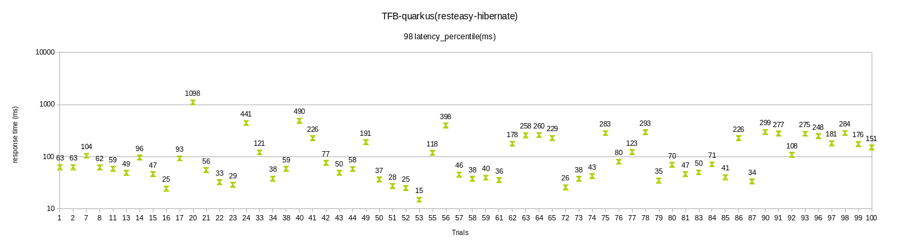
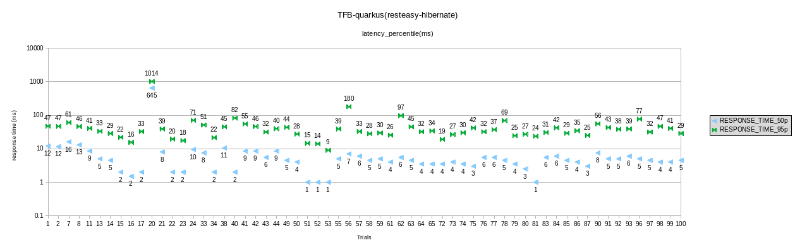

## All the experiments in this folder were run on shared infrastructure and require to be validated on a dedicated infrastructure. Manual runs are being run to reproduce the data with the best configuration which will be updated at [manuals](https://github.com/kruize/autotune-results/tree/main/techempower/experiment-2/manuals) dir

# Summary of data
- Min response time is observed with following configuration
```
   [Layer]            [Tunable]              [Default, Range]      Best Config
[Quarkus]   quarkus.thread-pool.core-threads   [1, 3-24]           =     9
[Quarkus]   quarkus.thread-pool.queue-size     [unbounded, 0-1000] =   989
[Quarkus]   quarkus.datasource.jdbc.min-size   [0, 2-10]           =     9
[Quarkus]   quarkus.datasource.jdbc.max-size   [20, 20-48]         =    33
[Hotspot]   maxinlinelevel                     [9, 9-50]           =    12
[Container] cpuRequest                         [None, 1-3.2]       =  1.06
[Container] memoryRequest                      [None, 270M-1024M]  =  702M
```
















