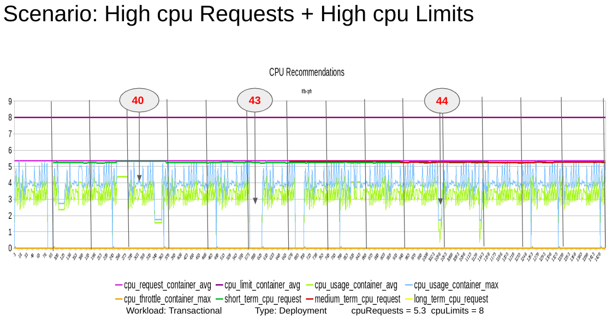
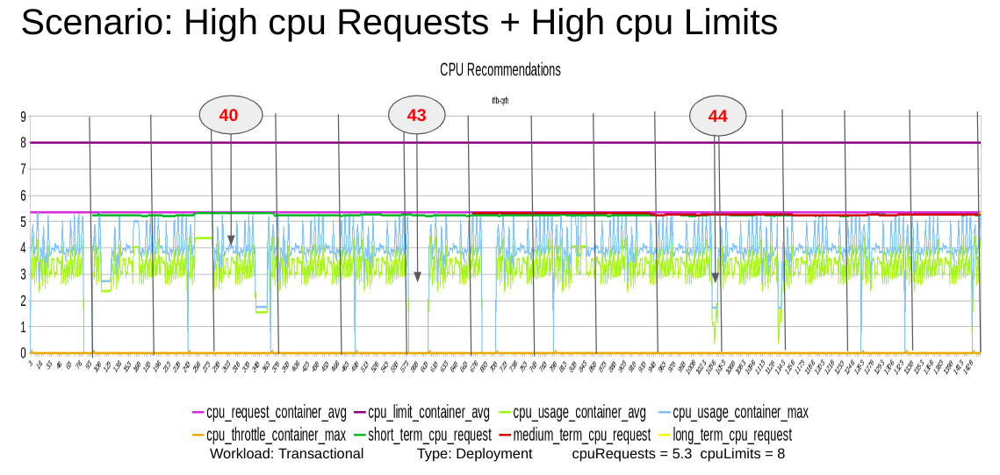
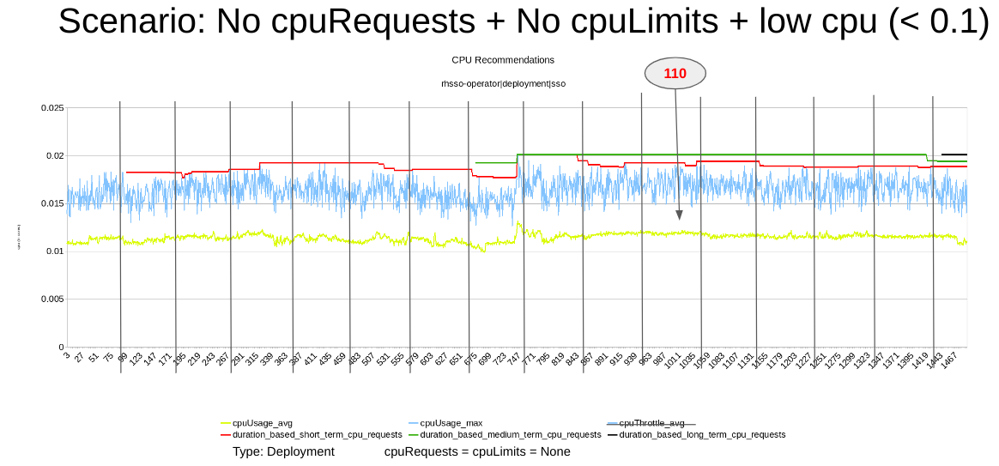
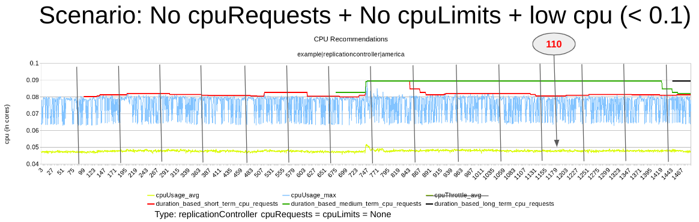
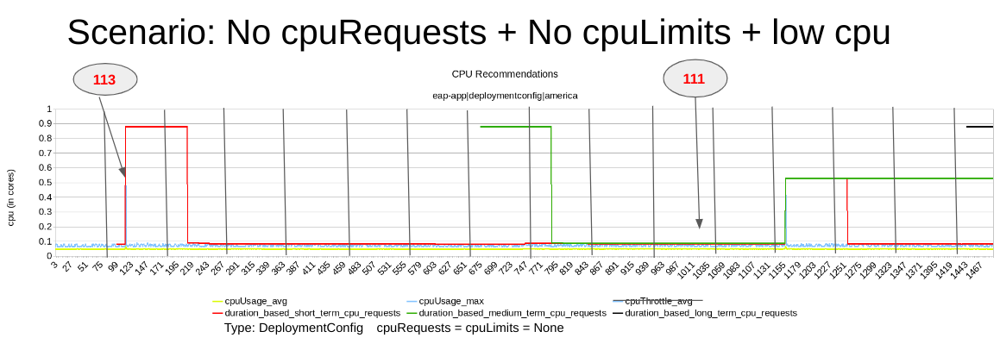
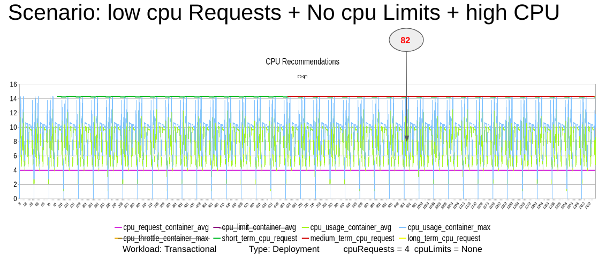
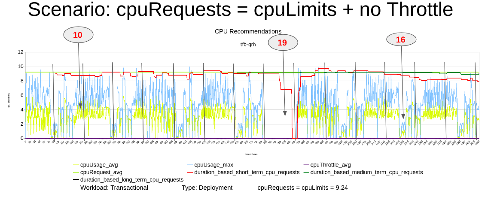
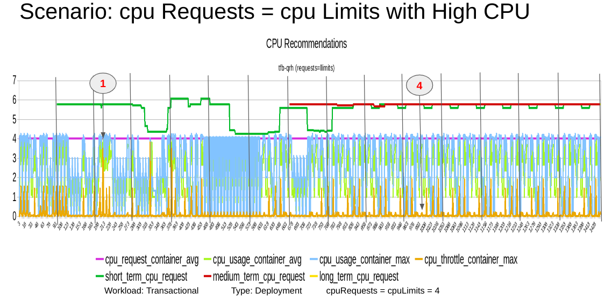

# Kruize Monitoring Results

This repository contains monitoring results collected from various sources and provides CPU and MEM recommendations generated by Kruize to validate.

## Overview

The purpose of this project is to collect data from multiple sources and validate the CPU and MEMORY recommendations generated by Kruize. The monitoring results offer insights into the behavioural changes in resource recommendations based on multiple scenarios.

## Monitoring Results

The monitoring results in this repository include data collected from different sources along with the charts which consists of resource usage metrics and the recommendations.

## CPU Recommendations

## Scenarios

Here are the list of [CPU Scenarios](./cpu-scenarios.csv)

### Charts

The following charts visualize the CPU recommendations derived from Kruize for the data given.

1. **Scenario: High cpuRequests - High cpuLimits:**
   
   

   

2. **Scenario: No cpuRequests - No cpuLimits:** 
   
   

   

   

3. **Scenario: Low cpuRequests - No cpuLimits:** 

   

4. **Scenario: cpuRequests same as cpuLimits:**

   

   

