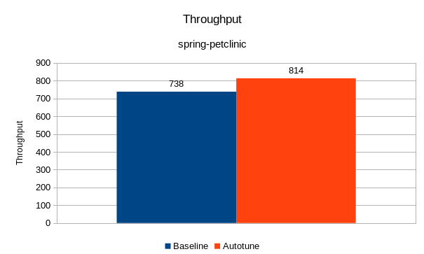
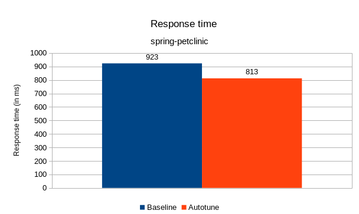
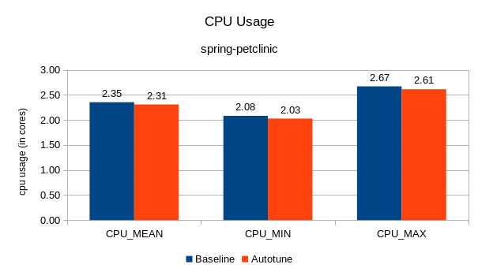
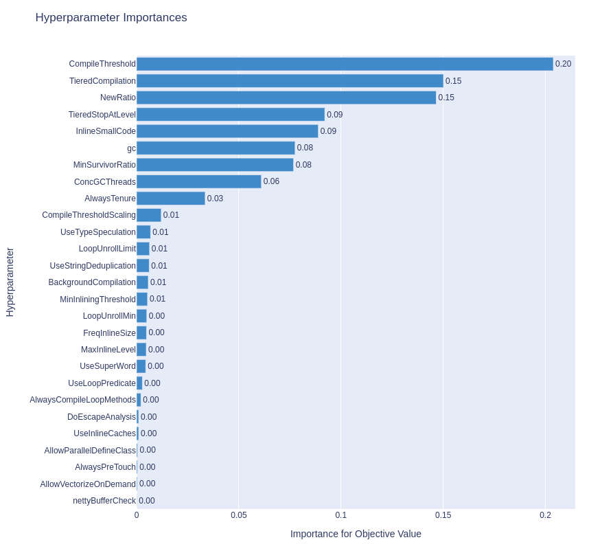
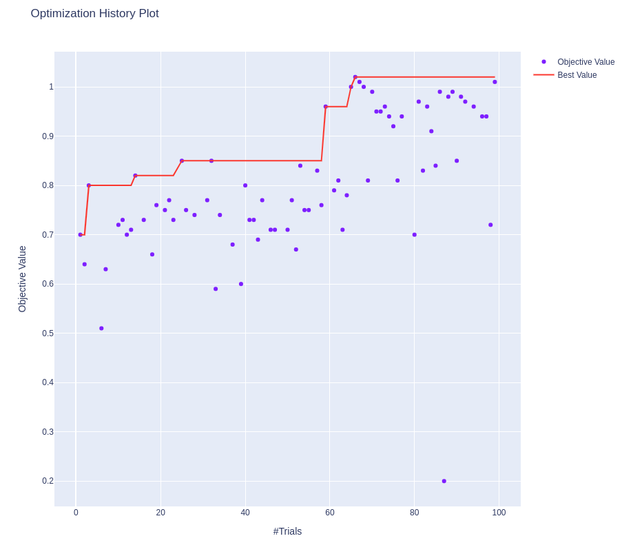
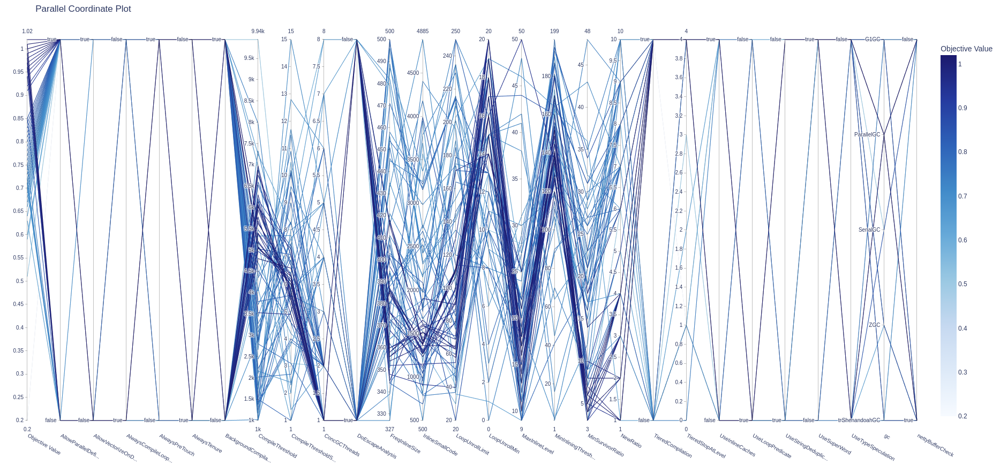
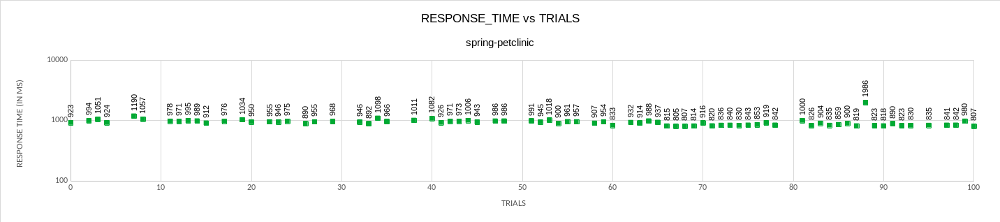
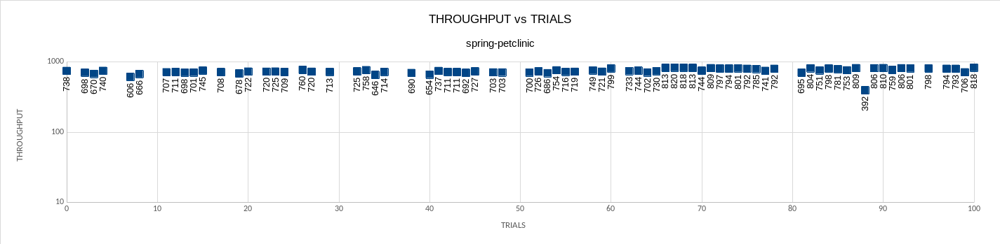

## All the experiments in this folder were run on dedicated infrastructure. Manual runs for the best configuration were run to reproduce the data and were updated at [manuals](manuals) dir

# Goal of the experiment:
	- Minimize transaction response time.
##
- For details on slo and benchmark, look into [benchmark.yaml](benchmark.yaml)
# Summary of data

- [Experiments](experiment-data-250users.csv) are started with 250 users. The cpu usage was not high enough to generate the best configuration.
- Increased the load to 1000 users and that [experiment](experiment-data-1000users-0.csv) had half of the trials failed because of `StackTraceInThrowable` being set to false as it throws `Error activating Bean Validation integration`.
- With [an experiment](experiment-data-1000users-1.csv) avoiding the `StackTraceInThrowable` tunable, the best configuration was not reached as 1/4th of the trials failed with low memory request.
- With [an experiment](experiment-data-1000users-2.csv) of increased lower bound memory_request, the best configuration is similar to baseline and 100 trials wasn't good enough to reach the best configuration. Higher importance was given to `cpu_request` tunable which is 93%.
```
TUNABLES IMPORTANCE: {"cpuRequest": 0.9328392172041294, "gc": 0.017726185575164324, "CompileThresholdScaling": 0.016512462448098498, "UseStringDeduplication": 0.007895108071513939, "MinSurvivorRatio": 0.006397577899472945, "memoryRequest": 0.003910986762625817, "LoopUnrollMin": 0.0020863858980406406, "InlineSmallCode": 0.0020290256859453837, "AlwaysTenure": 0.001886365036741722, "UseLoopPredicate": 0.0015153707864045218, "CompileThreshold": 0.0013119335874099468, "MinInliningThreshold": 0.0008312839903044749, "MaxInlineLevel": 0.0007301803172647918, "NewRatio": 0.0006771311257795164, "LoopUnrollLimit": 0.0005937277989507084, "UseSuperWord": 0.0004408139407191726, "BackgroundCompilation": 0.00043200186034053487, "nettyBufferCheck": 0.00034720240942900954, "AlwaysCompileLoopMethods": 0.00034496623201591624, "FreqInlineSize": 0.00034483345058080467, "ConcGCThreads": 0.0002934091605044816, "DoEscapeAnalysis": 0.000191593941358055, "AllowParallelDefineClass": 0.00018064627097296606, "UseInlineCaches": 0.00015603420843668048, "TieredStopAtLevel": 0.00010829441350227558, "AllowVectorizeOnDemand": 6.515932896093581e-05, "TieredCompilation": 5.922808512783518e-05, "UseTypeSpeculation": 5.1194075293857424e-05, "AlwaysPreTouch": 4.1680434910763e-05}
```
- As higher importance was given to cpu_request, and the top configurations in previous experiment picked 4 cores, a [new experiment](experiment-data.csv) is run with fixed resources. cpu requests and limits are set to 4 cores and memory requests and limits are set to 6192M.
- 9% improvement in Throughput and 13% reduction in response time is observed with the autotune generated config with the latest experiment with fixed resources.
- Importance of tunables for the expriment with fixed resources is 
```
TUNABLES IMPORTANCE: {"CompileThreshold": 0.21126999105402675, "TieredCompilation": 0.1590848770429188, "TieredStopAtLevel": 0.09903334152735807, "NewRatio": 0.08774695277051864, "InlineSmallCode": 0.08724333040335354, "MinSurvivorRatio": 0.07721586063108174, "gc": 0.06697777552739341, "AlwaysTenure": 0.05478894588418922, "ConcGCThreads": 0.05209835334530907, "LoopUnrollMin": 0.024423593938925986, "CompileThresholdScaling": 0.022741396365585743, "LoopUnrollLimit": 0.017850978292999867, "MaxInlineLevel": 0.013094192325883857, "FreqInlineSize": 0.007473182960920682, "MinInliningThreshold": 0.0047688439881825384, "AllowParallelDefineClass": 0.0031538810238043303, "BackgroundCompilation": 0.0029497046162944556, "UseLoopPredicate": 0.0016932864536894417, "UseStringDeduplication": 0.001536959678793778, "AlwaysCompileLoopMethods": 0.0015325953962789967, "nettyBufferCheck": 0.0009691975805057442, "UseInlineCaches": 0.0008715760201392748, "UseTypeSpeculation": 0.0006968775768994509, "UseSuperWord": 0.00042872346812990116, "AlwaysPreTouch": 0.0002776296906810519, "AllowVectorizeOnDemand": 7.185042143112016e-05, "DoEscapeAnalysis": 6.102014704496712e-06}
```

Note: Hotspot tunable ParallelGCThreads set same as ConcGCThreads to avoid JVM exit when ParallelGCThreads are less than ConcGCThreads.
Baseline / Default configuration used is cpu request and limit set to 4 ; memory request and limit set to 6192M 

Below data is based on the experiment with fixed resources when run with 1000 users.
- Trial 99 is considered as the best configuration in the experiment.
- Comparing the best configuration from autotune with the baseline, 
	- Response time reduced by ~13%
	- Throughput improved by 9%













In the above graphs, trial 0 is the data of default configuration which is considered as baseline.

### Configuration Details:
```
- JVM                   openjdk:11.0.6
```
- Machine: 
```
  - Server:  openshift cluster v4.8.13
    Master nodes	3
    Worker nodes	3
    CPU per node	32
    Memory per node	64G

  - Client: RHEL 8.3
    CPU  		64
    Memory 		64G  
```
- Load: 
```
 	Users :		512
	Threads :	56
```


Note: Best configuration from multiple trials is picked based on having least response time with good throughput, no errors while running the load and ensuring the data has met the convergence criteria.
Each trial would have an individual configuartion based on the tunables.For information on the configuration of a particular trial, look into experiment-data.csv
