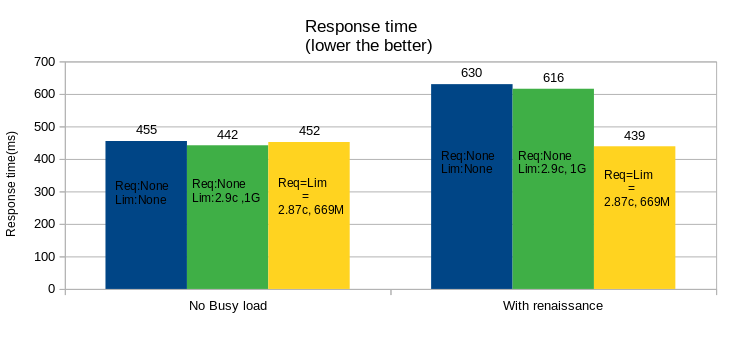

# Summary of data
- With busy load, no requests - no limits ; no requests - max limits the response time is high because of the contenction.
- Requests - limits generated by ML provides same response time with and without contention.

## Tunables:
cpurequest
memrequest

