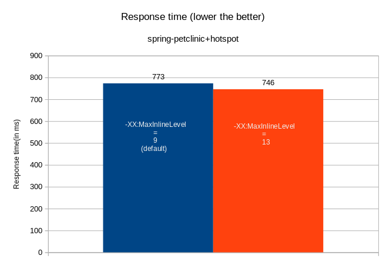

# Summary of all experiments
- Min response time is observed with MaxInlineLevel=13
- 3.6% reduced response time is observed.

## Tunables:
MaxInlineLevel range used is 9-50
- value represents maximum number of nested calls that are inlined.

## Configuration Used:
CPU_REQUEST=2.87
MEM_REQUEST=669M
CPU_LIMIT=3.5
MEM_LIMIT=1024M

Above graph comparison is based on [experiment-10](https://github.com/kruize/autotune-results/tree/main/spring-petclinic/tunables-maxinlinelevel/experiment-10) data.
