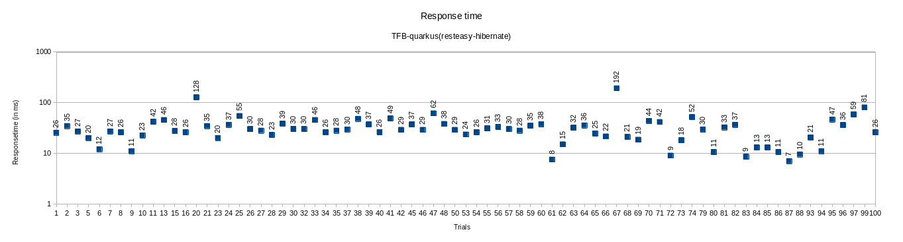
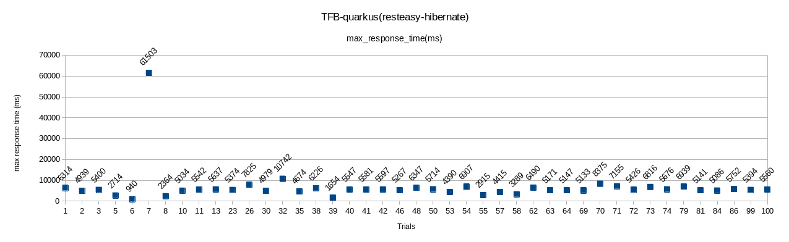

## All the experiments in this folder were run on shared infrastructure and require to be validated on a dedicated infrastructure. Manual runs are being run to reproduce the data with the best configuration which will be updated at [manuals](https://github.com/kruize/autotune-results/tree/main/techempower/experiment-1/manuals) dir.


# Summary of data
- 19.2% reduced response time with optuna optimization tunables.
- Min response time is observed with following configuration
```
   [Layer]            [Tunable]              [Default, Range]    Best Config
[Quarkus]   quarkus.thread-pool.core-threads   [1, 1-3]            =   2
[Quarkus]   quarkus.thread-pool.queue-size     [unbounded, 1-100]  =  58
[Quarkus]   quarkus.datasource.jdbc.min.size   [0, 0-50]           =   5
[Quarkus]   quarkus.datasource.jdbc.max.size   [20,20-50]           =  28
[Hotspot]   maxinlinelevel                     [9, 9-50]           =  12
[Container] cpuRequest                         [None, 1-3.2]       =  1.38
[Container] memoryRequest                      [None, 270M-1024M]  =  957M
```






