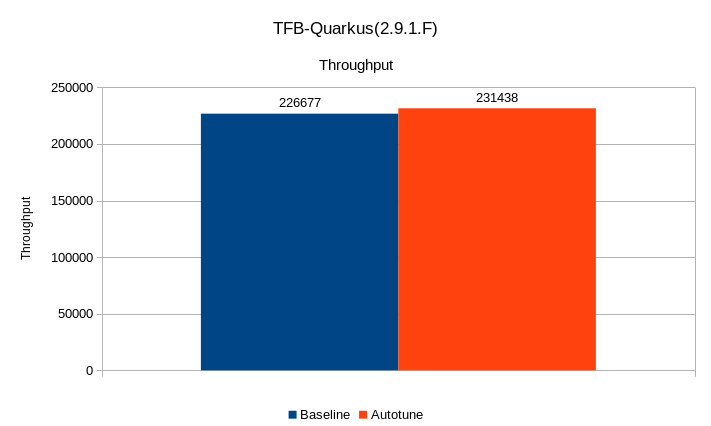
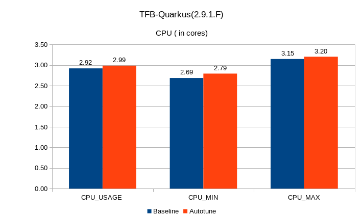
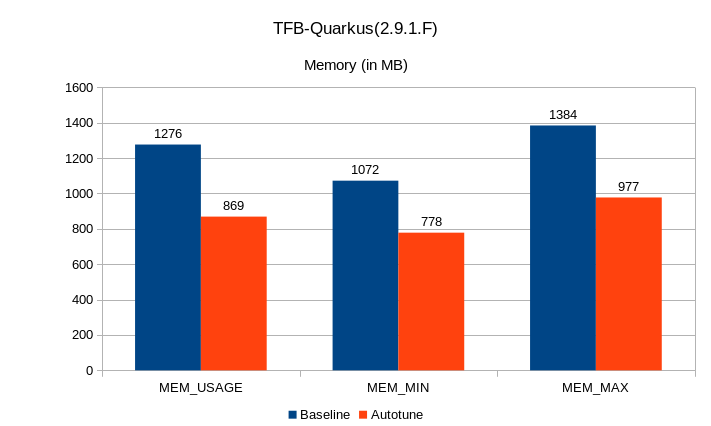

## All the experiments in this folder were run on dedicated infrastructure.

# Goal of the experiment:
- Maximize Throughput.

- For details on slo and benchmark, look into [benchmark.yaml](benchmark.yaml)

# Summary of data

This experiment uses constant container tunables. The configuration used is cpu request and limit set to 4 ; memory request and limit set to 4096M.
Along with the above tunables, other JVM options hardcoded are "-server -XX:MAXRamPercentage=70".
Quarkus tunable quarkus.datasource.jdbc.initial-size is set same as quarkus.datasource.jdbc.min-size to avoid min-size being picked with default when min-size is set higher than initial-size.
Hotspot tunable ParallelGCThreads set same as ConcGCThreads to avoid JVM exit when ParallelGCThreads are less than ConcGCThreads.

- The baseline and autotune configurations from the experiment is updated at [config.csv](config.csv). 
- This experiment uses Optuna TPE_multivariate algorithm and Quarkus version 2.9.1.F.
- Trial 104 is considered as the best configuration in the experiment.
- Comparing the best configuration from autotune with the baseline, 2% improvement in Throughput is observed.








### Configuration Details:
```
- JVM                   openjdk:11.0.6
- Quarkus               2.9.1.F
```
- Machine: 
```
  - Server:  openshift cluster v4.8.13
    Master nodes	3
    Worker nodes	3
    CPU per node	32
    Memory per node	64G

  - Client: RHEL 8.3
    CPU  		64
    Memory 		64G  
```
- Load: 
```
 	Users :		512
	Threads :	56
```


Note: Best configuration from multiple trials is picked based on having least response time with good throughput, no errors while running the load and ensuring the data has met the convergence criteria.
Each trial would have an individual configuartion based on the tunables.For information on the configuration of a particular trial, look into experiment-data.csv
