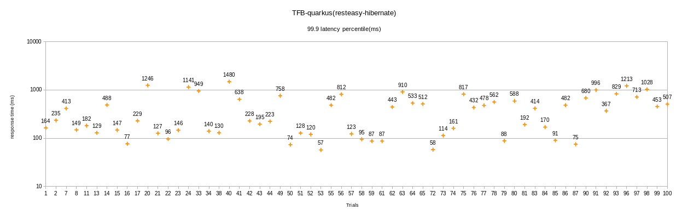

## All the experiments in this folder were run on a shared infrastructure and require to validate on a dedicated infrasture. Manual runs are being run to reproduce the data with the best configuration which will be updated at [manuals] (https://github.com/kruize/autotune-results/tree/main/techempower/experiment-2/manuals)

# Summary of data
- Min response time is observed with following configuration
cpurequest=1.01 (container layer)
memrequest=556M (container layer)
maxinlinelevel=11 (hotspot layer)
quarkus.thread-pool.core.threads=7 (quarkus layer)
quarkus.thread-pool.queue.size=450 (quarkus layer)
quarkus.datasource.jdbc.min.size=6 (quarkus layer)
quarkus.datasource.jdbc.max.size=31 (quarkus layer)

## Tunables:
- cpuRequest 				Range : 1 - 3.2
- memoryRequest 			Range: 270MB - 1024MB
- maxinlinelevel			Range : 9 - 50
- quarkus.thread-pool.core.threads	Range: 3 - 24
- quarkus.thread-pool.queue.size	Range: 0 - 1000
- quarkus.datasource.jdbc.min.size	Range: 2 - 10
- quarkus.datasource.jdbc.max.size	Range: 20 - 48

